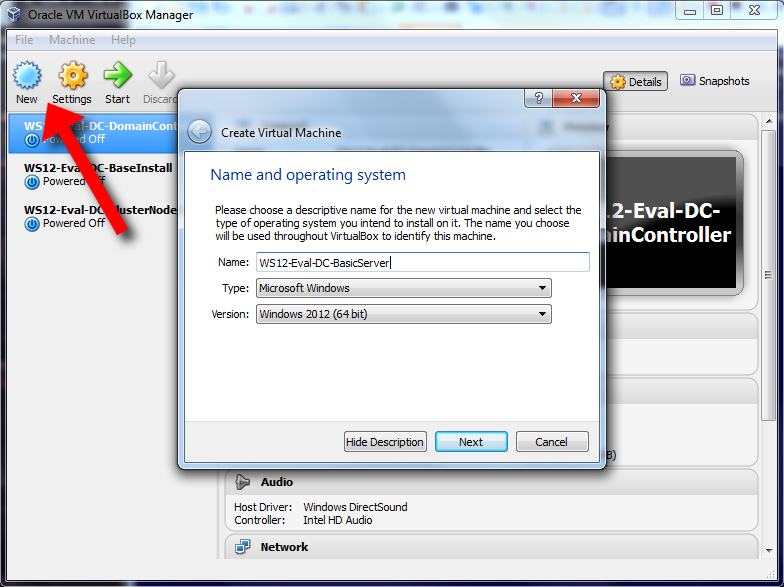
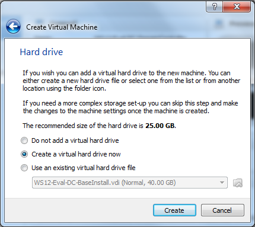
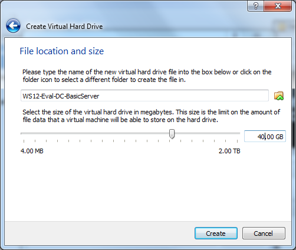
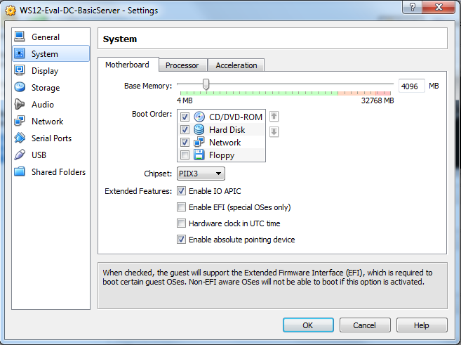
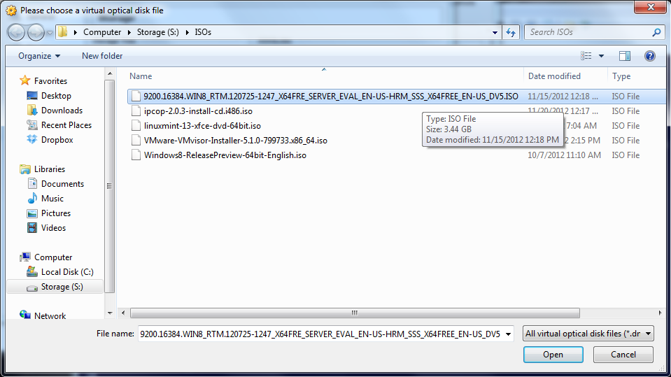
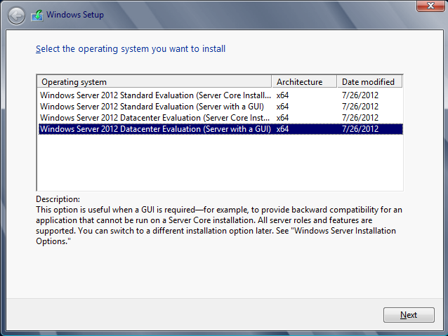
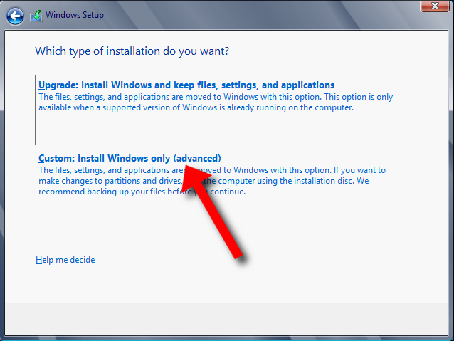
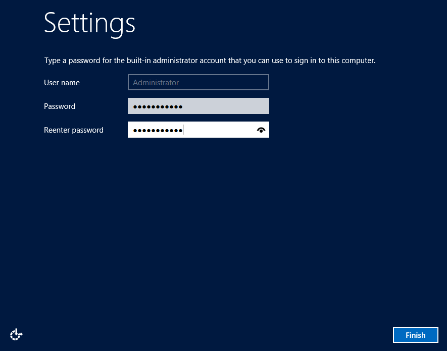
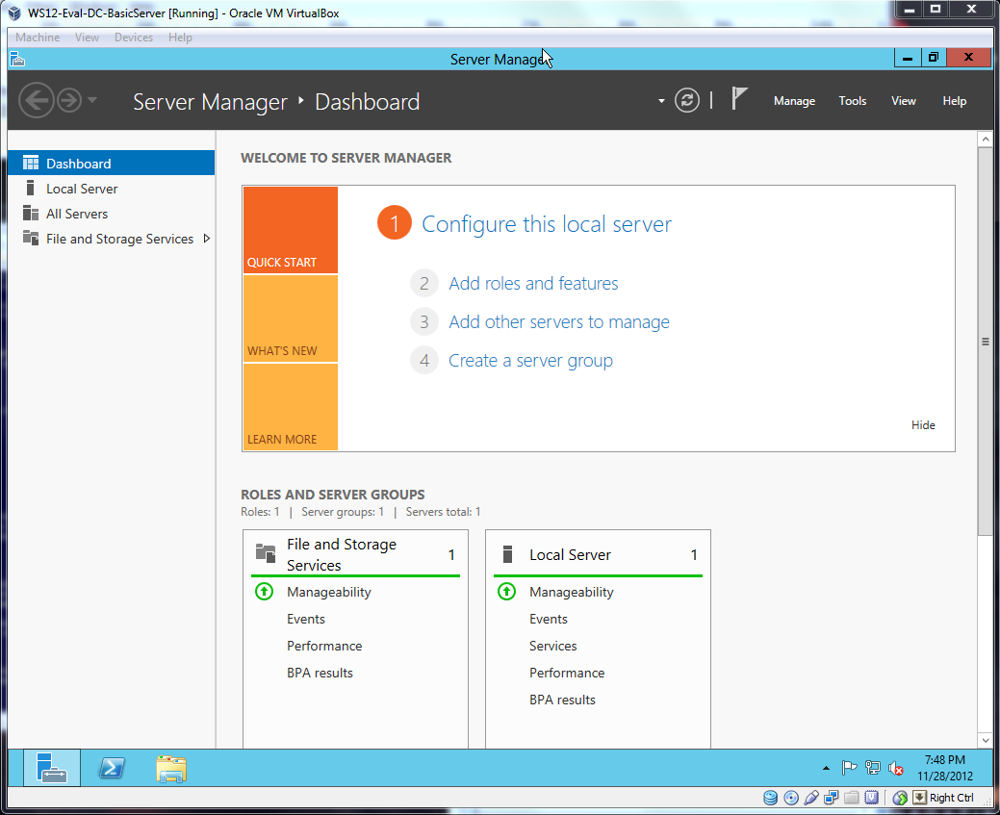

## Installing Windows Server 2012 on a Base VM

Last time, I described some of the hardware and software you'll need to follow along with this project and create your own virtual lab. Bascially, it boiled down to your own computer and free software online - nice, right? This installment will concentrate on two main points: creating a basic virtual machine through VirtualBox, and installing Windows Server 2012 on it. Let's jump in!

### It's VM; not Vim

Creating a new virtual machine in VirtualBox couldn't be easier. Begin by clicking on the New button in the upper-left hand corner of the program. This will open a pop-up box. Choose the version of Windows you are installing (I chose "Windows 2012 (64 bit)"), and give your new machine a name. Mine is "WS12-Eval-DC-BasicServer," which tells me that it is the Evaluation version of Windows Server 2012, and that I'll be installing the Datacenter version of the product.

After clicking Next, you'll have to determine how much memory to allocate. I chose 4096MB, which is 4GB. And don't fret over this step, it's simple to change after the fact.

Next, VirtualBox will ask if you want to create a virtual hard drive. I'd suggest doing it now as it's simpler. When you click on next, it will ask what kind of file to create. I just use the VDI option. Next, it will ask if you want to dynamically allocate or use a fixed drive size - basically, it's asking if you want to grow out the file now or later. I usually choose dynamic as I've not noticed a performance hit on my machine.

Finally, it will ask you to name and size the drive. I leave the name the same as my machines for simplicities sake, but I do tend to increase the drive size from the suggested minimum. For example, all my machines have 40GB drives. Once you hit create, the machine is finished and will be added to the list of VMs on the left-side of the program.

I would suggest changing a few more settings at this point by right-clicking on the machine and choosing "Settings..." On the system tab, you'll want to turn off the Floppy option, turn on the Network option, and re-order the boot sequence. It is important that CD-ROM is first in the list, since that's how we'll install Windows Server momentarily. It's in the System tab that you can adjust the memory and number of processors as well. I'm leaving mine at 4GB and 1 processor for now.

In the Storage tab, you'll see the virtual hard drive we created earlier. It's at this time that you could add additional drives to the machine to simulate a more complicated storage setup. I'm not going to: my purpose is practicing networking so I'm not too worried about how many hard drives I have at the moment. (Plus, you can always add them later if you wish.)

But what is important to notice is the "Empty" CD-ROM in the IDE Controller. Highlight it, and then click the CD-minus button below to remove it.

Ignore the warning. Then highlight the IDE Controller and click the CD-plus button. Select the "Choose disk" option. Navigate to the location of your Windows Server ISO and open it. We've simulated inserting the disc into a CD-ROM drive pre-boot.

Click the Ok button when you are finished, because we're ready to install Windows.

### Installing Windows Server 2012

Click on the green Start arrow in VirtualBox to launch the new VM. At this point, we're going to concentrate on installing Windows. It's quite simple. Choose your language and keyboard settings as appropriate, click Next, and then Install.

As I mentioned before, I'm installing the Datacenter version of the software. I'm also installing it with the GUI components instead of Server Core alone. If you want practice administering servers via command line, you'll want to choose the Core option instead.

After ignoring the license and accepting the terms blindly, you'll want to choose the option, "Custom: Install Windows only (advanced)" to install a fresh copy of the software.

You should see a hard drive with the same size as allocated before. Click the Next button and begin the wait. Your VM will restart as necessary at the end of the process.

Finally, you'll come to an Admin setup screen. Enter a good password (twice) and finish up.

### Navigating your New Install

VirtualBox is quite nifty when it comes to sharing the keyboard and mouse between the VMs and the host machine. Typically, whatever has focus has the control. That means that if you roll your mouse over the VM window, it should take over control. If you click inside of it, you'll be able to type.

The tricky part, natually, is _Ctrl+Atl+Del_. In order to perform this action within a VM, you simply need to use the **_Right Ctrl_ + Del**. This is important since you won't be able to log in otherwise!

Once you've logged in to the server, I suggest getting to know the Server Manager panel, but do take care to not change any of the settings of the machine, since we'll be using this as a base for all the other VMs that we create later on. We want this to be a vanilla install so we can build on it differently each time we duplicate it.