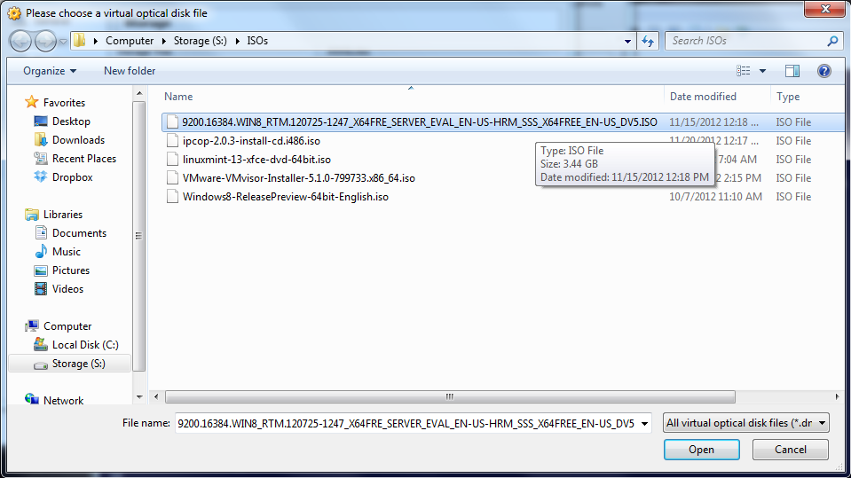
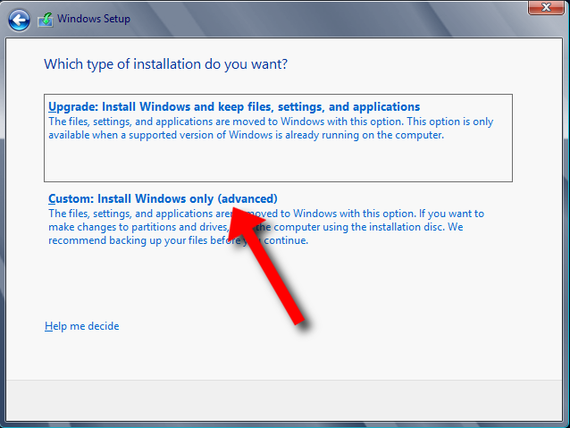
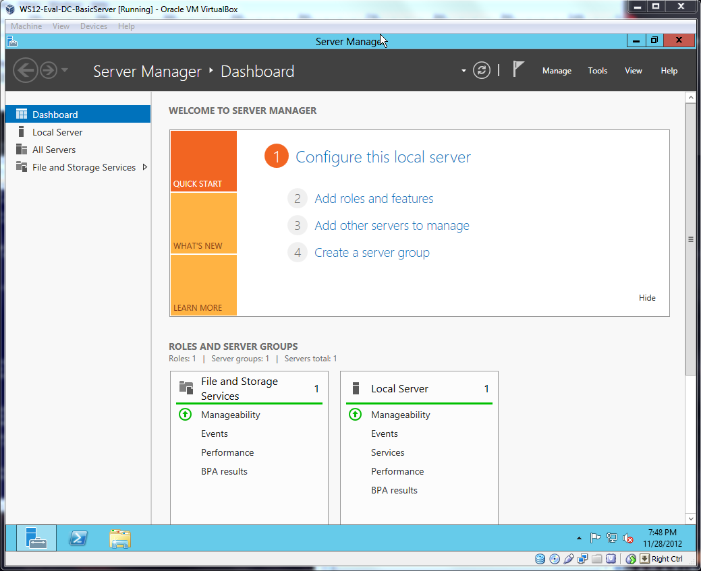

# Build your own Virtual Lab

## Why Build a Virtual Lab?

We all come to the DBA trade from different backgrounds. Some have worked in IT in a different specialty - programmers, network admins, and help desk. But others have a different background altogether: admin assistants, data entry, and other kinds of business users. For those of us from non-IT backgrounds, there are experiences that we may miss. Personally, while I was somewhat adept at building websites, I felt pretty lost when it came to networks and servers.

Of course we can pick up bits here and there, but there are more complete ways to learn these skills. Thanks to the powerful state of computing, we can set up virtual environments. Naturally, setting up a networked environment (AKA: lab) will allow for further experimentation with SQL Server as well, such as clustering, mirroring, and replication projects.

### Our Requirements

While building a lab can be time arduous, it isn't overly complicated nor does it have to be expensive. Here's the basic requirements:

  * A computer
  * [Oracle's VirtualBox](https://www.virtualbox.org/wiki/Downloads)
  * [Windows Server 2012 Evaluation Edition](http://technet.microsoft.com/en-US/evalcenter/hh670538.aspx?ocid=&wt.mc_id=TEC_108_1_33)
  * [StarWind iSCSI SAN Free Edition](http://www.starwindsoftware.com/starwind-free)

Assuming you have access to a computer at home or work, VirtualBox, Windows Server, and StarWind iSCSI SAN are all free. And this is important for those without MVP or other access to MSDN for software needs.

If you can afford to spend on your computer, you can build a nicer lab. Since we'll be relying on virtualization, you'll want a beefy host (the computer running VirtualBox) so you can run more virtual machines (guests) concurrently. This is how we'll create a networked environment utilizing multiple guests.

### Hardware Considerations for your Lab

Here are the specs on my desktop computer. While it may seem impressive, your host doesn't require as much hardware.

  * (64-bit) Windows 7 Pro
  * Intel i5 four-core CPU
  * 32GB of memory
  * Crucial SSD for C: drive
  * 1TB HHD for storage

There are two points to consider for your operating system. First, you need to run a 64-bit version so you can access more than 3.5GB of memory. Second, [even the 64-bit version of Windows you choose has an effect on how much memory you can access](http://msdn.microsoft.com/en-us/library/windows/desktop/aa366778(v=vs.85).aspx#physical_memory_limits_windows_7). For example, Windows 7 Home Premium will limit you to 16GB, which should be fine for our purposes, but if you can afford Professional Edition (or greater), you won't have to worry about RAM limitations.

As for the processor, you'll want a minimum of four cores. If you can afford a processor with hyper-threading, which will double the number of cores presented to your system, that's even better.

The amount of memory is important, and thankfully memory continues to remain inexpensive. I've read examples where people have created sparse environments using only 8GB of memory, but 12GB to 16GB minimally will give some breathing room to run multiple machines.

As for storage, I am running a combo of an SSD for Windows while everything else is dumped on a large HHD. You don't need to get this complicated: a single hard drive will do fine just as long that it has the space necessary to create all the virtual hard disks. Otherwise, it may become a storage balancing act.

## Installing Windows Server 2012 on a Base VM

Installing VirtualBox is simple, so we won't review that here. But once it is installed, you'll be ready to create your first virtual machine (VM) and install Windows Server 2012 onto it.

### It's VM; not Vim

Creating a new virtual machine in VirtualBox couldn't be easier. Begin by clicking on the New button in the upper-left hand corner of the program. This will open a dialog box. Choose the version of Windows you are installing (I chose "Windows 2012 (64 bit)"), and give your new machine a name. Mine is "WS12-Eval-DC-BaseInstall." It's a personal system which tells me that it is Windows Server 2012 (WS12), Evaluation version (Eval), and that I'll be installing the Datacenter version of the product (DC). BaseInstall is the purpose of this machine. You can follow whatever naming scheme that makes sense to you.

After clicking Next, you'll have to determine how much memory to allocate. I chose 4096MB, which is 4GB. And don't fret too much over this decision; it's easy to change after the fact.

Next, VirtualBox will ask if you want to create a virtual hard drive, which we will. When you click on next, it will ask what kind of file to create; choose the VDI option. Next, it will ask if you want to dynamically allocate or use a fixed drive size - basically, it's asking if you want to size the file now or grow it later. While using fixed drive is typically better for performance, choose dynamic instead as it will help you save significant storage space. This is a test system, and we're likely to make mistakes while learning, so we're not going to be worried about drive performance at this point.

Finally, it will ask you to name and size the drive. I leave the name the same as my machines for simplicity's sake, but I do tend to increase the drive size from the suggested minimum. For example, all my machines have 40GB drives. Clicking Create, the machine is finished and will be added to the list of VMs on the left side of the program.

I would suggest changing a few more settings at this point by right-clicking on the machine and choosing "Settings..." On the system tab, you'll want to turn off the Floppy option, turn on the Network option, and re-order the boot sequence. It is important that CD-ROM is first in the list, since that's how we'll install Windows Server. It's in the System tab that you can adjust the memory and number of processors as well. For now, you can leave your settings at 4GB and 1 processor.

In the Storage tab, you'll see the virtual hard drive that was created earlier. If you'd like to simulate a more complicated storage setup, you could create and add more virtual drives now. Again since we're practicing networking, we're not going to worry about adding additional drives at this time.

Most importantly, click on the Network tab. Make sure that Adaptor 1 is enabled (it should be by default), and change it from NAT to Internal Network. If you'd like to know more, [VirtualBox has some good documentation about the different Network settings.](http://www.virtualbox.org/manual/ch06.html) Simply, we're telling VirtualBox that this server is plugged into a switch on the _intnet_ network. While this will be the default network for our domain, we'll also set up a second internal network for our iSCSI storage.

Click the OK button when you are finished, because we're ready to install Windows.

### Installing Windows Server 2012

Click on the green Start arrow in VirtualBox to launch the new VM. A new window will open with the machine booting up inside of it. You'll be prompted to add your installation media by a dialog box.

Clicking on the folder with a green Up arrow, you'll be taken to your file system to find and choose the Windows Server 2012 iso that you downloaded from Microsoft.

At this point, installing Windows is simple. Choose the appropriate language and keyboard settings, click Next, and then Install.

As mentioned, we're installing the Datacenter version of the software. (You could just as easily install the Standard edition; it won't matter for the purposes of our lab.) Be sure to install it with the GUI components instead of Core alone. If you want practice administering servers via command line, you'll want to choose the Core option instead, but that's another lesson for another day.

Ignore the license and blindly accept the terms. Choose the option, "Custom: Install Windows only (advanced)" to install a fresh copy of Windows.

You should see a hard drive with the same size as allocated previously. Click the Next button and begin the wait. Your VM will restart as necessary at the end of the process.

Finally, you'll come to an Admin setup screen. Enter a memorable password (twice) and finish up.

### Navigating your New Install

VirtualBox is quite nifty when it comes to sharing the keyboard and mouse between the VMs and the host machine. Typically, whatever has focus has control. That means that if you roll your mouse onto the VM window, it should take over control. If you click inside of it, you'll be able to type.

The tricky part is _Ctrl+Atl+Del_. In order to perform this action within a VM, you  need to use the **_Right Ctrl_ + Del** only. This is important since you won't be able to log in otherwise!

Once logged in, take a quick look around, but do not change any of the settings of the machine. We're about to reset everything so we can use it as a model for all the other VMs we'll be creating later in the process.

### Sysprep the Windows SID

What's the Windows SID? It's a [security ID assigned by Windows](http://en.wikipedia.org/wiki/Security_Identifier). Within a network, SIDs should be unique to each machine. However, during the VirtualBox cloning process, they can be duplicated. But if we sysprep our new install immediately, we can save the machine in a state where every clone will start up and generate a new, unique SID.

In your VM, open up the PowerShell prompt (you should find a shortcut on the Taskbar at the bottom), and type in the following command to open the System Preparation Tool.
    
    C:\Windows\System32\Sysprep\sysprep.exe
    

Leave it in Out-of-Box mode, click the Generalize button, and choose the Shutdown option.

> **This is not recommended for production systems**. We can get away with it _because it is our own lab_.

Once you click the okay button, the system will work on resetting itself, and shut down once complete. From now on, every VM that you clone from this base install, you'll need to do some basic system setup (similar to the install), but you shouldn't run into the duplicate SID issue.

## Clone of my Own (VM)

Even though it wasn't difficult to install Windows, it would be nice to avoid having to sit through a bunch of installs. And you can thank VirtualBox's cloning functionality that you won't have to.

### Cloning VMs

Cloning a VM is dead simple. Simply right-click on the Base Install that we created moments ago, and choose "Clone..."

VirtualBox will ask for a new name. Following convention, name it "WS12-Eval-DC-DomainController," since we'll be creating a domain controller next. You should also check the box to Reinitialize the MAC addresses.

On the next screen, choose Full Clone since we want these to be completely separate machines. VirtualBox process for a few minutes, and will present your newly cloned machine in the list. As mentioned, when you start it up, you'll have to do some minor setup work.

## Building a Windows Cluster

At this point, we're going to change tacts and focus on building an example networked environment in VirtualBox. We will focus on creating a Windows Server 2012 failover cluster.

Clustering two or more computers together provides higher availability to a resource through redundancy. Each of the clustered computers is called a Node. Although the nodes within a cluster are distinct machines, they are presented to other computers and users as a single resource through an access point recorded in the DNS Server. We can see the basic components of a cluster in the diagram.

Building a cluster is a bit like following a recipe. In order to cook up a cluster, we need the following ingredients:

  * Domain Controller
  * Shared Storage
  * Two (or more!) Windows Servers with Failover Clustering installed

And inside of VirtualBox, we'll also complete some fancy settings with the Network Adapters.

 

## Setting up your Domain Controller

The domain controller will act as the base for our network, and allow us to join multiple servers to one domain. In the above diagram, the domain controller is the blue server at the top. We'll be up and running in two steps: installing the appropriate roles to our server, and configuring our controller.

### Before the First Restart

If you haven't already, clone a new VM and name it "DomainController." In its Network Settings, make sure that it only has one adapter, and that it is set to the _intnet_ Internal Network.

Once you've started your VM, click on the first heading, "Configure this local server." On the new screen, click on the Computer Name to bring up a dialog box to change it. Click on the Change... button and change the computer's name to DomCon. Once you click OK to apply the change, you'll be prompted to restart now or later. Choose later, since there is more work we can do before we _absolutely_ need to perform a restart.

After changing the name, click on "IPv4 address assigned..." on the Ethernet setting a few lines down. Right-click on the Ethernet network and choose Properties. In the Ethernet Properties pop-up box, double-click the "Internet Protocol Version 4 (TCP/IPv4)" connection to open it's properties.

Inside of the properties, we'll be setting up a static IP address for our domain controller. You can follow the example I've provided in the screenshot (I chose 10.0.0.1), or you can [check out the different options available](http://en.wikipedia.org/wiki/Private_network#Private_IPv4_address_spaces) as described by Wikipedia. In a nutshell, the IP address should be specific to each machine, and we'll want to route the machine back to itself for DNS purposes by using 127.0.0.1. We can leave the default subnet mask as is. As for the default gateway, we can leave it blank since we've told VirtualBox to think of itself as directly plugged into a network switch.

Click OK and exit out of the network settings. Return to the Dashboard (upper-left) and click on "Add roles and features." Click through the first page. Choose Role-based or feature-based installation on the Installation Type page, and choose the DomCom server as the target in the Server Selection page. (It should be the only one listed even though the name change hasn't taken effect yet.) On the Server Roles page, click the boxes for Active Directory Domain Services (ADDS) and DNS Server. Be sure to add all the features as requested by the wizard, and don't worry about any warnings that pop-up: you can click through them at this point.

As for additional Features on the next page, you won't need to add anything extra. Click thru to the Confirmation page, click the "Restart the destination server..." box at the top, and finally click the Install button. Once the installation has completed, your server should restart automatically. If not (and it didn't in my case...), simply open up PowerShell and run the "Restart-Computer" command.

### After the Restart

Log back into your machine. If you click on "Configure this local server," you'll notice that your changes have been applied. The final bit of work to do is to set up a new domain for your network. In the upper-right hand corner, you'll see a flag with a yellow warning triangle. Click on it, and you should see a post-deployment configuration task waiting for you. Click on "Promote this server to a domain controller."

In the Deployment Configuration, select "Add a new forest" and supply a name for your domain. I've chosen sqllab.local.

On the next page, add a password for the Directory Services Restore Mode. The remainder of the options can (more or less) be clicked thru till install. Again, the server should automatically reboot after the operation completes. We've set up our domain controller!

## Setting up Shared Storage

Computers that have been clustered together rely on a shared source of storage to manage the data used by the application. Should the active node in a cluster fail, the inactive node should be able to take over processing while still accessing the data maintained on the shared storage. Typically, this storage will reside on a Storage Access Network (SAN). In our diagram, this storage is represented by the purple disk icon at the bottom.

For our purposes, we need a way to emulate shared storage. We need a SAN.

### Fakey SAN

[Joey D'Antoni](http://twitter.com/jdanton) told me about a program by StarWind Software that's dead simple for setting up shared storage. It's called [StarWind iSCSI SAN Free Edition](http://www.starwindsoftware.com/starwind-free), and it's what we'll use to complete this exercise. Even though you have to sign up for an account to download (and you can't use an @gmail.com address...), it's completely worth it due to the incredible ease of the program. It will let us focus on clustering rather than figuring out some other shared storage solution.

While you are logged in to StarWind's site, be sure to pick up the following White Papers and Technical Papers as well. They will be invaluable during this process.

  * [Using StarWind with MS Cluster on Windows Server 2008](http://www.starwindsoftware.com/using-starwind-with-ms-cluster-on-win2008-server)
  * [How to Build a SAN Guide](http://www.starwindsoftware.com/build-a-san-guide)
  * [How to Configure a Failover Cluster using Microsoft Windows 2003/2008](http://www.starwindsoftware.com/microsoft-server-clustering-101-guide)
  * [How to Configure a Server Cluster using MS SQL Server 2008](http://www.starwindsoftware.com/sql-server-clustering-guide)

At minimum, make sure to download the first paper: [Using StarWind with MS Cluster on Windows Server 2008](http://www.starwindsoftware.com/using-starwind-with-ms-cluster-on-win2008-server). Even through it focused on Windows Server 2008, we're going to reference it through the rest of the clustering process because the differences are minor in Windows Server 2012.

### Installing StarWind

Installing StarWind couldn't be simpler, but Joey informed me that the program has a bug: it doesn't uninstall properly. For this reason, we're going to install it on it's own VM.

Begin by cloning a fresh VM and name it "SharedStorage." Enter the Network Settings, and make sure that it is using the Internal Network adapter, *but* change the network's name to _storage_.

Why are we using a different network for the storage? What about the _intnet_ network? We have to do this for technical reasons when using iSCSI disks in a cluster. Simply, if we're going to use iSCSI disks (and we are), then [they should use a different network than our domain](http://technet.microsoft.com/en-us/library/jj612869.aspx).

Once you've finished with the network settings, start your VM and set it up as per normal with a name and static IP address. Since we need our iSCSI disks to reside on a different network than our domain, use 192.168.0.20 for your static IP. This will generate a subnet mask of 255.255.255.0, ensuring that our domain traffic and storage traffic are on totally separate networks. You can leave the default gateway and DNS server blank.

You'll also need to install a special set of tools called Guest Additions. It will allow us to transfer the StarWind program and license key file from the host computer to the VM. Install it by clicking on the Devices menu item, and selecting "Install Guest Additions..." The machine will act as though you inserted a "Guest Additions" CD in the CD-ROM drive, but you can simply follow the installer.

Once Guest Additions has been installed, go back to the main VirtualBox console and open the Settings for the SharedStorage VM. Click on the Shared Folders tab, and then the folder with the green plus sign in the upper-right hand corner. A pop-up box will ask which directory you'd like to share with the machine. In my case, I shared my Downloads by opening up the File Path, choosing Other, clicking on my user name, and then selecting the Download folder. When you click OK, that location will appear as a Transient Folder. Click OK again to save the new settings.

Inside of the SharedStorage VM, open the Explorer and go to Network. You should see a computer called VBOXSVR; if not, just heed the yellow warning box and turn on sharing. Inside of that location should be a folder named VBOXSVRDownloads. And inside is your download location (or whichever other directory you decided to share). Copy the StarWind program and its license key file from your host to your VM. I placed mine directly on the C: drive for ease of access.

At this point, the installation of StarWind is quick. Double click the program to start and follow the recommended options. Near the end, you'll be asked to enter your license key: open up the file dialog box and point it at the key file you copied.

### Creating a Shared Storage Volume

At first glance, it isn't immediately obvious what to do to create and share a storage volume. That documentation we downloaded earlier, [Using StarWind with MS Cluster on Windows Server 2008](http://www.starwindsoftware.com/using-starwind-with-ms-cluster-on-win2008-server), is important now since we'll reference it through the remaining portions of the clustering process. Again, there are some minor difference, which I'll guide you through here.

In StarWind, right-click on the server under the StarWind Servers list. It'll have one of those random, autogenerated names, which is fine. Select Connect. Two more items will appear in a list under the server name: Targets and Devices. To create a network shared volume, you create a new Target and assign a Device to it. If you are following along with StarWind's guide, this is covered on pages 6 through 20 - but it's just a bit different in this new version of StarWind.

Add a new Target by right-clicking on the Targets item in the Servers list, and select Add Target. Next, add an alias as per the guide (I called mine SqlData), _but_ you should also click the box to "Allow multiple concurrent iSCSI connections (clustering)." Then click Next twice and the Finish button to add the target. In the guide, it automatically segued into the Devices dialog, but the latest version of the program doesn't do that anymore.

To assign a Device to the SqlData target, right-click on the newly created target in the Target List, and choose "Add a New Device to the Target."

Adding the device is similar to the steps described in the guide. Choose Virtual Hard Disk, click Next. Choose Image File device, click Next. Choose Create new virtual disk, click Next. On the parameter page, when you have to choose a name and location, if you decide to use an "images" directory (as per the guide), you'll have to create it first or else the program won't be able to create the disk image.

Add a disk size. Don't worry about the other parameters right now. Click Next three more times to accept the default values and finish the device creation. You have a shared drive ready to be included in a cluster!

## Building a Windows 2012 Cluster

In this final section, we're going to create our two nodes, and cluster them together. As a reminder, a cluster is a grouping of two or more computers that are used to provide higher availability to a resource, such as an application or a database. In our diagram, the two nodes are represented by the two green computers in the center. You can see a vague green bubble around them signifying they've been clustered into a single resource.

### Cluster Up

In VirtualBox, you'll want to clone two new machines. Name them "Node1" and "Node2" respectively. Going into the network settings for each machine, you'll want to make sure that they each have _two_ network adapters enabled. Both should be of the Internal Network kind, but one should be named _intnet_ while the other should be named _storage_. This is important since these nodes will have to communicate with both the domain (on the _intnet_ network) and the shared storage (on the _storage_ network).

As a general tip, you'll want to continue to start and set up your nodes side-by-side. This greatly quickens the process and you can be more certain that you're repeating the same setup steps on each machine.

Once you've started and logged onto both machines, you'll want to set them up with new names and static IP addresses. The names are easy, but the IP addresses can be a little tricky. Even if in the Network Settings you told adapter 1 to be _intnet_ and adapter 2 to be _storage_, VirtualBox doesn't have to equate those settings with Ethernet and Ethernet2 exactly.

The way to test this is easy. On Node1, enter a static IP that would connect with the domain's _intnet_ network (10.0.0.11) in Ethernet. Open PowerShell. Type in **ping 10.0.0.1**. If you can ping the domain controller (and it has to be running to do this), then you've guessed correctly on the Ethernet adapters. Finish by adding 10.0.0.1 as the Preferred DNS Server for the _intnet_ adapter. You can finish your setup by entering the IP 192.168.0.11 for the _storage_ network in Ethernet 2.

If your ping wasn't successful, you'll have to switch the IP addresses between Ethernet and Ethernet2. Repeat this IP testing process on Node2.

Once you've set up your IP addresses, you can join the two nodes to the sqllab.local domain. Do this in the Local Server Properties by clicking on the Workgroup setting. Click on the Change... button. Click on the Domain selector in the "Member of" box. Enter the domain administrator's credentials to join the domain. (This is the administrator of the domain controller, not the local server.) Natually, you'll have to restart after joining the domain.

Once you've joined your two new machines to the domain, you're ready to begin the process of clustering them. We'll refer to StarWind's guide, [Using StarWind with MS Cluster on Windows Server 2008](http://www.starwindsoftware.com/using-starwind-with-ms-cluster-on-win2008-server). Pages 21 through 45 (don't fret: there's a lot of images!) describe the process of using the iSCSI Initiator to discover the shared storage volume and then using Disk Management to partition it. Start in Node1 by clicking on the Tools button in the top-left corner, then choosing the iSCSI Initiator. You'll need to turn it on. Other than that, Windows 2012 follows the guide closely. Once you've connected it, you can get to the Disk Management by clicking on that same Tools button and choosing Computer Management.

When you repeat the process on Node2, you'll only need to bring the disk online in the Computer Manager since it's already been partitioned. (_Note: the guide goes through two shared volumes. We're not going to; just use the same SqlData volume we created last time._) You do want to make sure that the shared volume is using the same drive letter on both nodes.

Once the shared storage has been connected and partitioned on both nodes, return to Node1 to install the Failover Clustering Feature (in the guide, this occurs over pages 46 through 49). Back on the main page, click on option 2, "Add roles and features." Once the wizard starts however, click Next until you get to the Features tab. That's where Failover Clustering is (rather than being a Role). Install the additional add-ons as well. Click Next, and then Install. Restart the server and repeat the process on Node2.

Once both nodes have restarted, we're going to test the clustering settings. Should they pass, we can immediately cluster the two nodes. If not, we'll have to do some troubleshooting. (This is described in the guide over pages 68 to 74.)

With both nodes running, enter Node1 **but use your domain login**. This is the admin account that we created on the domain controller. In my case, the login is SQLLAB\Administrator. You can use the little back arrow in the login screen to Switch Users. This is necessary to test and install the cluster.

Once logged in, click on the Tools button, and choose Failover Cluster Manager. Click on Validate Configuration. Follow the wizard by adding your nodes, and choosing to Run all tests. Assuming all returned well (and you may see some non-critical errors), you're ready to cluster those nodes.

When you click Finish, you should immediately jump into the Create a Cluster wizard. (Creating the cluster is described over pages 75 to 81 in the guide.) Click Next, give your cluster a name and complete the IP address for it that uses the same network as the domain. I used 10.0.0.15. Uncheck the other IP address that is connected to the _storage_ network (that's the one beginning with 192.168.0.__). Click next two more times to validate and create the cluster!

Congratulations on clustering Windows Server 2012! From here, you could go on to investigate clustering SQL Server, checking out AlwaysOn Availability Groups, or building a completely different network architecture. Enjoy!
